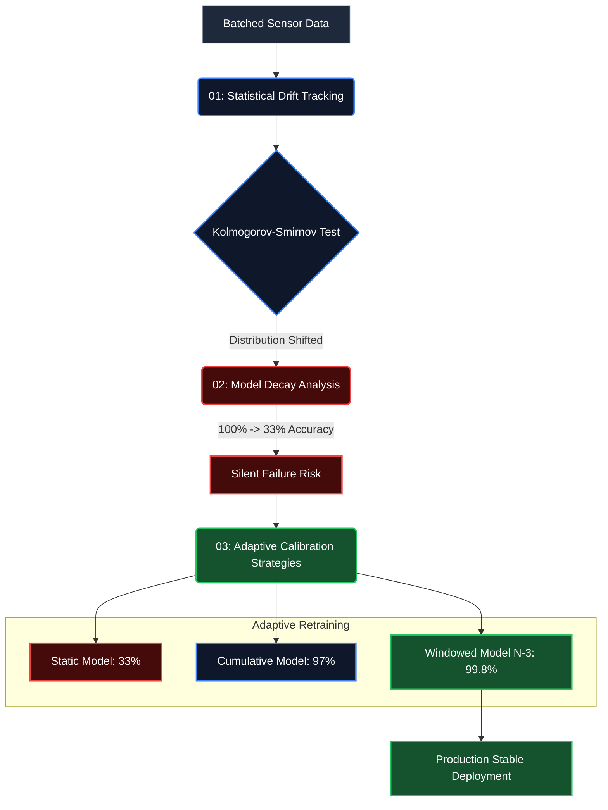

# Gas Sensor Drift Monitoring
## When Your ML Model Slowly Goes Wrong

**Tech:** Python, scikit-learn, matplotlib  
**Author:** Alex Domingues Batista

---

## 📊 Executive Summary

- Static classification models trained on Month 1 baseline sensor data degrade from **100% → 33% accuracy** by Month 36.
- The fundamental issue is physical **concept drift**: as metal oxide sensors age, their electrical resistance responses to gas exposures drift monotonically.
- Implementing an adaptive windowed retraining strategy (leveraging the trailing 3 measurement batches) maintains predictive accuracy at **>99%** across the entire 3-year sensor lifecycle.
- **Key takeaway:** In IoT and industrial deployments, ML model decay is silent but inevitable. Robust monitoring and recalibration protocols are mandatory for production stability.

---

## 🔬 The Analytical Challenge: Sensor Aging

In analytical instrumentation, hardware calibration is inherently ephemeral. Sensors age with thermal cycling, active surfaces become poisoned or fouled, and environmental baselines fluctuate. In the laboratory, we manage this via rigorous daily recalibration protocols.

When deploying Machine Learning on sensor arrays, models face the exact same physical reality. A static ML model trained on a pristine, newly manufactured sensor array will experience **concept drift** as the physical hardware degrades. The model will not throw an execution error; it will simply generate increasingly confident but incorrect predictions, leading to silent failures in production.

---

## Dataset

UCI Gas Sensor Array Drift Dataset:
- 16 metal oxide sensors measuring 6 different gases
- 36 months of data split into 10 batches
- Sensors were left to age naturally (no maintenance)

This is a worst-case scenario for concept drift—perfect for studying the problem.

---

## 🛠️ Pipeline Architecture



### 1. Statistical Proof of Drift Tracking

Before engineering a heavy retraining pipeline, it is crucial to mathematically prove that the data distribution is shifting (rather than assuming performance loss is purely combinatorial noise).

**Statistical testing (Kolmogorov-Smirnov):**
- 94 out of 128 sensor features exhibited significant distributional shift (p < 0.001) across the 36-month timeline.
- Median KS statistics remained elevated (0.3-0.4), indicating severe non-stationarity.

**Latent Space Trajectory (PCA):**
- Projecting the batched data into principal components reveals a clear, monotonic drift vector of the cluster centroids over the 3-year period. This confirms the physical aging of the sensors is systematic, not random.

### 2. Quantifying Model Decay

A baseline Random Forest classifier was trained exclusively on Batch 1 (Month 1-2) data and deployed for inference on all subsequent batches without updates.

| Inference Batch | Timeline | Accuracy |
|-----------------|----------|----------|
| 1 | Baseline | 100% |
| 5 | Mid-life | 68% |
| 10 | End-of-life | 33% |

**Result:** A 67% absolute drop in accuracy as the hardware drifted away from the training distribution.

### 3. Adaptive Calibration Strategies

To counteract hardware drift, four dynamic retraining policies were benchmarked:

| Retraining Policy | Training Data Utilized | Final Batch Accuracy |
|-------------------|-------------------------|----------------|
| **Static** | Batch 1 only | 33.0% |
| **Cumulative** | Batches 1 through (N-1) | 97.0% |
| **Naive Sequential** | Batch (N-1) only | 89.0% |
| **Windowed** | Batches (N-3) to (N-1) | **99.8%** |

**Engineering Conclusion:**
Windowed retraining is the optimal protocol. Relying *only* on the immediately preceding batch introduces too much variance (susceptible to short-term noise). However, retaining *all* historical data (Cumulative) forces the model to synthesize obsolete, "pristine" sensor states with degraded current states, diluting the decision boundaries. A sliding window of 3 batches perfectly balances stability with current state representation.

---

## Files

```
gas-sensor-drift-monitoring/
├── 01_visualizing_the_drift.ipynb    # Statistical proof that drift exists
├── 02_model_decay_analysis.ipynb     # How bad the decay gets
├── 03_adaptive_calibration.ipynb     # Retraining strategies compared
├── Dataset/                          # 10 batch files
└── README.md
```

---

## Running It

```bash
# Get the data
wget https://archive.ics.uci.edu/ml/machine-learning-databases/00270/Dataset.zip
unzip Dataset.zip

# Clone and run
git clone https://github.com/alexdbatista/data-science-portfolio.git
cd data-science-portfolio/gas-sensor-drift-monitoring
pip install -r requirements.txt
jupyter notebook
```

Run notebooks in order: 01 → 02 → 03

---

## 🚀 Future Enhancements

1. **Automated Statistical Triggers:** Shift from time-based recalibration schedules to metric-driven triggers (e.g., executing retraining pipelines only when the multi-dimensional KS statistic exceeds a predefined tolerance threshold).
2. **Online Learning Implementations:** Deploy incremental learning algorithms (e.g., Stochastic Gradient Descent or Hoeffding Trees) to continuously update weights without requiring full batch re-computation.
3. **Cost-Optimization Calculus:** Model the financial trade-off between the computational/annotation cost of retraining versus the business cost of a 1% drop in classification accuracy.

---

## Why This Matters for My Background

## 🧪 Domain Expertise Translation

Having spent over a decade in analytical chemistry configuring instrument calibration protocols, tracking baseline drift, and running QC standards, the mental model for ML operations (MLOps) maps perfectly to laboratory quality assurance:

| Analytical Laboratory Concept | Machine Learning Equivalent |
|-------------------------------|-----------------------------|
| Chromatographic baseline drift | Data distribution shift (Covariate drift) |
| Calibration curve expiration | Decision boundary obsolescence (Concept drift) |
| Routine QC tracking charts | Automated statistical drift monitoring |
| Recalibration via standard curves | Directed model retraining pipelines |

Hardware expertise provides an intuitive advantage when architecting ML pipelines for physical sensors: understanding *why* the data is changing dictates *how* the algorithms should adapt.

---

## Dataset Citation

```
Vergara, A., et al. (2012). Chemical gas sensor drift compensation 
using classifier ensembles. Sensors and Actuators B: Chemical, 166, 320-329.
```

Data: https://archive.ics.uci.edu/ml/datasets/gas+sensor+array+drift+dataset
