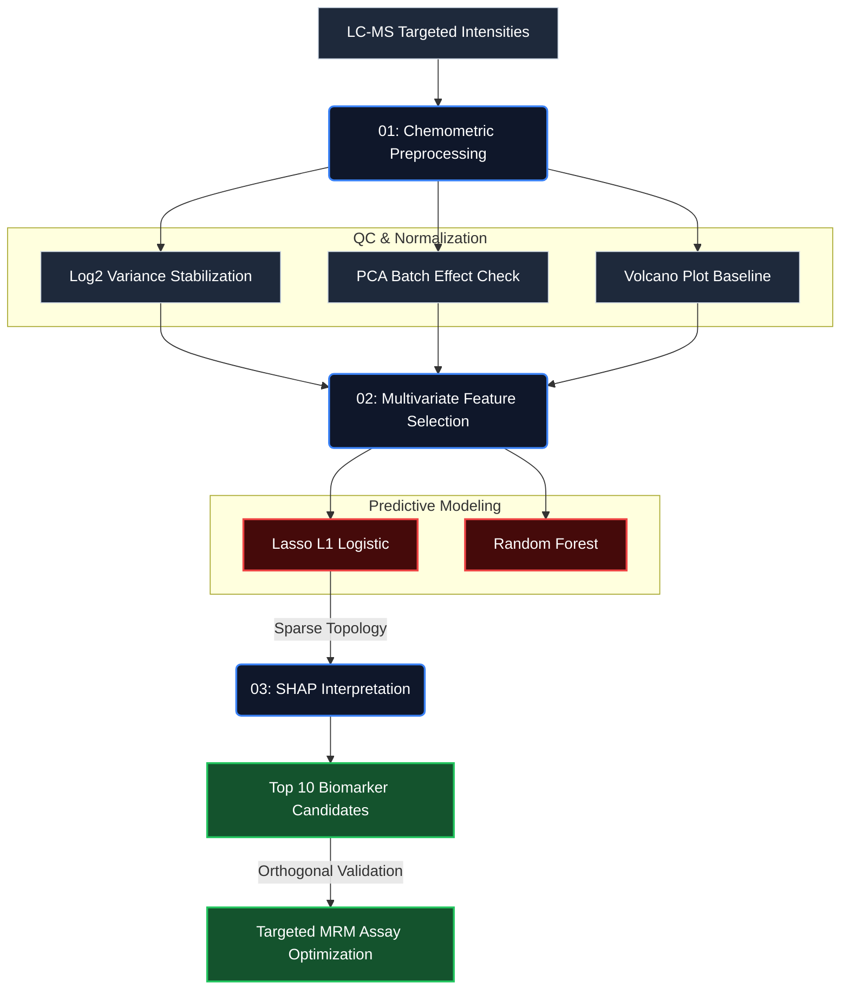

# Metabolomics Biomarker Discovery
## Using SHAP to Prioritize What to Validate Next

[](https://www.python.org/)
[](https://github.com/slundberg/shap)
[](https://scikit-learn.org/)

---

## 🔬 The Challenge: High-Dimensionality in LC-MS Biomarker Discovery

In targeted and untargeted metabolomics, the core analytical challenge isn't acquiring the data—it's managing the curse of dimensionality. Validating candidate biomarkers through targeted assays (e.g., MRM/SRM on triple quadrupole instruments) or broader clinical cohorts is cost-prohibitive. The standard chemometric approach (univariate t-tests with FDR correction) often fails because it fundamentally ignores the metabolic network structure.

This pipeline demonstrates a multivariate approach to prioritize LC-MS features. By training regularized surrogate models and extracting SHAP (SHapley Additive exPlanations) values, we can move beyond single-analyte significance to identify the feature sets that actually drive separability between clinical phenotypes.

---

## Dataset

Human cachexia study (muscle wasting syndrome in cancer patients):
- 76 samples (47 cachexia, 29 control)
- 63 metabolites measured by LC-MS
- Anonymized identifiers (Metabolite_1, Metabolite_2, etc.)

Small dataset, high dimensionality—exactly the situation where feature prioritization matters most.

---

## 🛠️ Pipeline Architecture



### 1. Chemometric Preprocessing
Standard transformation protocols for liquid chromatography-mass spectrometry peak intensities:
- Log₂ transformation to stabilize variance (standardizing multiplicative noise in MS detectors)
- Principal Component Analysis (PCA) for initial QC and batch-effect checking.
- Univariate differential analysis (Volcano plots) to baseline against classical methods. Current dataset yields 35 initially "significant" candidates—still too broad for efficient targeted validation.

### 2. Multivariate Feature Selection
Benchmarked sparse linear models (L1 regularization) against ensemble methods:

| Model Structure | CV Accuracy | ROC-AUC | Rationale |
|-----------------|-------------|---------|-----------|
| **Lasso (L1 Logistic)** | **57.9%** | **0.668** | Handles p >> n regimes; forces strict sparsity |
| Random Forest | 48.6% | 0.498 | Overfits heavily on heavily noisy, small-n cohorts |

*Note on performance:* A ~58% accuracy on a highly noisy n=76 dataset is metabolomically typical. The objective here is feature ranking, not clinical deployment. 

### 3. SHAP Interpretation for Assay Prioritization
Lasso coefficients only tell part of the story. Extracting exact SHAP values maps the marginal contribution of each metabolite to the diagnostic output.

**Key Analytical Finding:** The top 10 highly-ranked metabolites capture >80% of the predictive signal space. Translating this to the lab: a targeted MRM method requires optimization for only 10 analytes instead of 63, drastically reducing method development time and standard costs.

---

## 🔬 Clinical Validations & Limitations

- **Multivariate context vs. Univariate limits:** SHAP identifies critical analytes that fail simple biological thresholding but act as key network suppressors or amplifiers in the pathway.
- **Directional insight:** Unlike standard Gini impurity in Random Forests, SHAP's topological mapping immediately demonstrates if an upregulated analyte correlates with the pathological state.
- **Statistical Power Limits:** With n=76, the model parameters lack tight convergence bounds. Prioritization from this pipeline strictly requires orthogonal targeted-MS validation on an independent biological cohort.

---

## Files

```
metabolomics-biomarker-discovery/
├── 01_chemometric_eda.ipynb       # Data quality, PCA, volcano plot
├── 02_biomarker_ml.ipynb          # Model training and comparison
├── 03_shap_interpretation.ipynb   # SHAP analysis and rankings
└── README.md
```

---

## Running It

```bash
cd metabolomics-biomarker-discovery
python -m venv .venv
source .venv/bin/activate
pip install -r requirements.txt
jupyter notebook
```

Run notebooks in order: 01 → 02 → 03

---

## 🧪 Domain Expertise Context

Data output from LC-MS systems is not generic tabular data—it is fundamentally subject to the physics of electrospray ionization, matrix suppression effects, and chromatographic resolution limits. 

My 10+ years of laboratory background in analytical chemistry and LC-MS method development informs this ML pipeline:
- **Missing Data Physics:** In mass spec, a `NaN` is rarely random (MCAR); it often represents an analyte falling below the Limit of Detection (LOD), requiring specialized biological imputation.
- **Signal-to-Noise Reality:** Knowing which low-intensity features are likely chemical noise vs. authentic metabolites guides model sparsity parameters.
- **Batch Effects:** Recognizing the drift characteristics of LC columns and tuning chemometric normalization to account for instrument variation before passing tensors to a machine learning estimator.

---

## Tech Stack

- Python 3.10+
- pandas, numpy, scikit-learn
- SHAP 0.45+
- matplotlib, seaborn

Runs in <2 minutes on a laptop.

---

## References

**SHAP:**
- Lundberg & Lee (2017), [NIPS paper](https://arxiv.org/abs/1705.07874)
- [GitHub: slundberg/shap](https://github.com/slundberg/shap)

**Metabolomics Standards:**
- [Metabolomics Standards Initiative](http://www.metabolomics-msi.org/)
- [HMDB (Human Metabolome Database)](https://hmdb.ca/)
