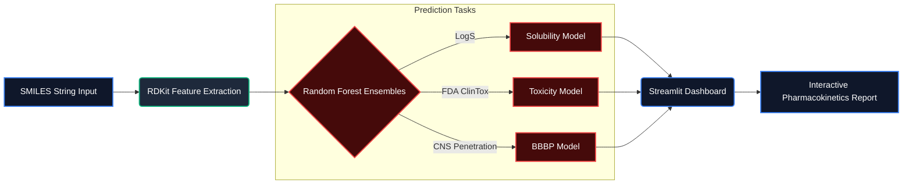

# 🧪 ToxPred AI: In-Silico ADMET Screening Platform


**ToxPred** is a Machine Learning application designed to accelerate early-stage drug discovery protocols. It predicts critical physicochemical and biological properties of small molecules before physical synthesis, enabling computational chemists to filter out non-viable candidates early in the pipeline.

## 🚀 Key Features

* **💧 Solubility Prediction (LogS):** Rigorous regressor trained on the **Delaney (ESOL)** dataset predicting aqueous solubility boundaries.
* **☠️ Toxicity Screening:** Binary classifier trained on the **ClinTox (FDA)** dataset to flag structural motifs associated with clinical trial failures.
* **🧠 Blood-Brain Barrier (BBB) Permeability:** Classifier trained on **BBBP** data to predict CNS penetration—a critical assay for neuropharmacology.
* **💊 Drug-Likeness:** Automatic calculation of **Lipinski’s Rule of Five** to assess oral bioavailability.
* **🧬 Structural Intelligence:** Uses **Morgan Fingerprints (ECFP4)** to analyze chemical substructures (2,048-bit vectors) rather than simple molecular weights.

## 📊 Model Performance

| Model | Dataset | Algorithm | Metric |
| :--- | :--- | :--- | :--- |
| **Solubility** | Delaney (ESOL) | Random Forest Regressor | R² ≈ 0.87 |
| **Toxicity** | ClinTox (FDA) | Random Forest Classifier | Acc ≈ 76% |
| **BBB Permeability** | BBBP | Random Forest Classifier | ROC-AUC ≈ 0.85 |

## 🛠️ Tech Stack

* **Language:** Python
* **Cheminformatics:** RDKit (Molecular Descriptor Calculation & Fingerprinting)
* **Machine Learning:** Scikit-Learn (Random Forest Ensemble)
* **Web Framework:** Streamlit
* **Data Source:** DeepChem & PubChem PUG REST API

## 📦 Deployment Architecture



The repository contains pre-trained Random Forest models serialized via joblib in the `*.pkl` format. While model artifacts are typically housed in blob storage rather than git, tracking these specific baseline models (~18MB total) enables:
- **Zero-cold-start inference** in Streamlit Cloud environments.
- Immediate deterministic reproducibility without requiring users to pull from DeepChem.

To safely retrain the architecture locally via the data pipeline:
```bash
python step_models.py  # Fetches DeepChem datasets & rebuilds RF ensembles (~2-5 minutes)
```

## 💻 Installation & Usage

1.  **Clone the repository:**
    ```bash
    git clone https://github.com/alexdbatista/data-science-portfolio.git
    cd data-science-portfolio/toxpred
    ```

2.  **Install dependencies:**
    ```bash
    pip install -r requirements.txt
    ```

3.  **Run the App** (models are pre-trained and included):
    ```bash
    streamlit run toxpred_app.py
    ```

4.  **(Optional) Regenerate models from scratch:**
    ```bash
    python step_models.py
    ```
    
    **Note:** This downloads datasets from DeepChem and trains three Random Forest models:
    - `solubility_model.pkl` (~9 MB)
    - `toxicity_model.pkl` (~3 MB)
    - `bbb_model.pkl` (~5 MB)

## 🧪 Example Use Cases

* **Aspirin:** Predicted as **Safe** and **Soluble**.
* **Dopamine:** Predicted as **BBB Impermeable** (correctly identifying the pharmacokinetic barrier that necessitates L-DOPA delivery systems in Parkinson's).
* **Dieldrin (Pesticide):** Explicitly flagged as **Toxic**, driven by the highly chlorinated ring substructures recognized by the structural fingerprint.